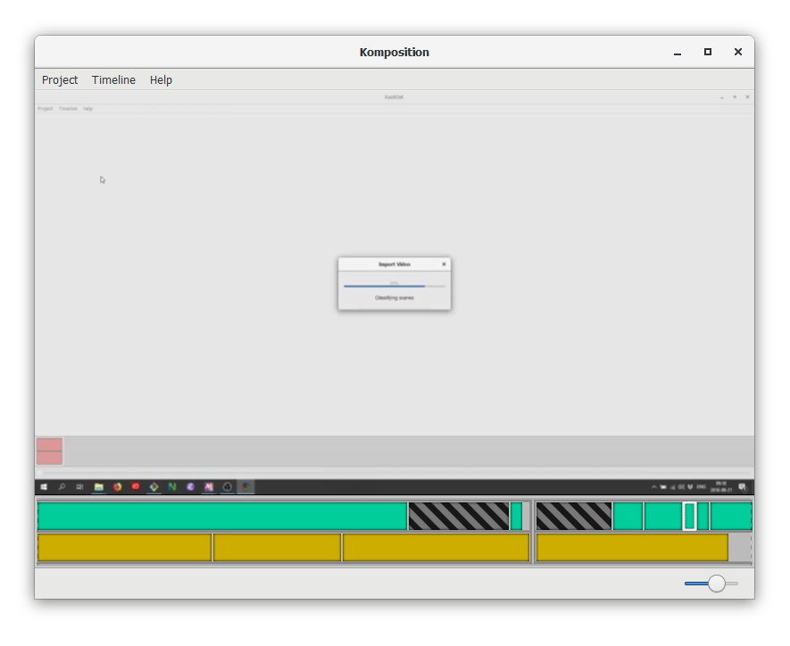

<h1>Komposition</h1>

The video editor built for screencasters

<a href="https://owickstrom.github.io/komposition/user-guide/introduction/">Introduction</a> |
<a href="https://owickstrom.github.io/komposition/user-guide/installation/">Installation</a>

  <a href="https://www.youtube.com/watch?v=VRmn76TZadg">Tutorial Video</a>
  

## Documentation

See [the documentation and user guide](https://owickstrom.github.io/komposition/).

## Build Instructions

This project can be built using Stack, Cabal, and Nix. Please see the
[Installation docs](https://owickstrom.github.io/komposition/) for build
instructions.

## License

Mozilla Public License Version 2.0

Copyright 2018 Oskar Wickström
